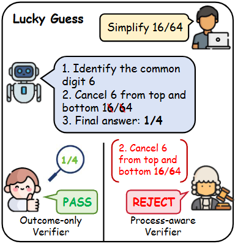
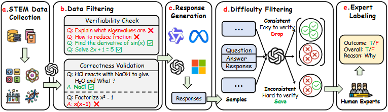
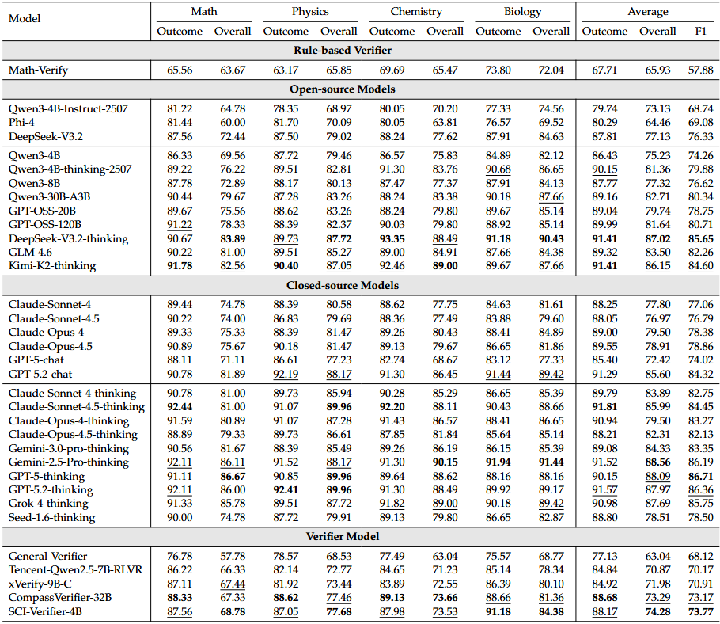
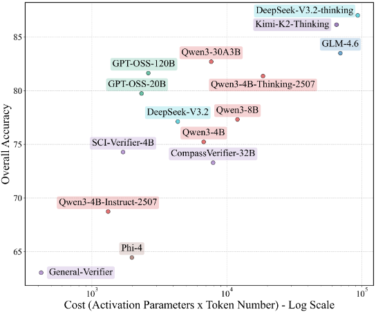
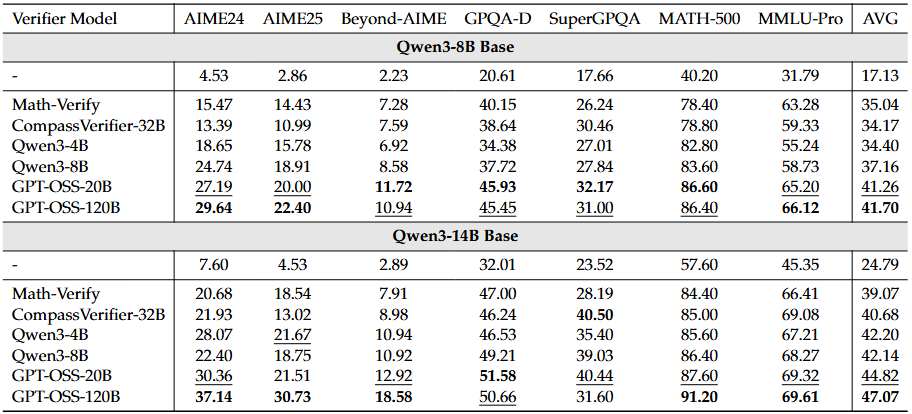
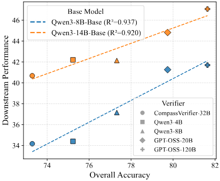

<h1 align="center"> PRIME: A Process-Outcome Alignment Benchmark for Verifiable Reasoning in Mathematics and Engineering </h1>

<div align="center">
  <a href="https://arxiv.org/abs/xxxx.xxxxx"> 
  </a>
  <a href="https://huggingface.co/collections/wonderful9462/prime">
    
  </a>
  <a href="https://github.com/wonderful9462/PRIME">
    
  </a>
</div>

<h5 align="center"> If you find our work useful, please give us a star ⭐ on GitHub.</h5>

## 🌟 Highlights

- **🔍 Process-Outcome Misalignment:** We identify a critical gap in current RLVR (Reinforcement Learning with Verifiable Rewards) where models receive positive rewards for correct final answers despite incorrect derivation processes.
- **📚 PRIME Benchmark:** A high-difficulty, college-level STEM benchmark containing 2,530 samples, specifically designed to evaluate whether verifiers can detect flaws in the reasoning process, not just the result.
- **🚀 PRIME-RL Framework:** A process-aware RLVR training paradigm that significantly improves the alignment between reasoning steps and final outcomes, leading to more robust reasoning performance.

## 📦 Dataset & Models

We provide the **PRIME Benchmark**, the **PRIME-RL** series of models, and the comprehensive training datasets used to align process and outcome.

### Models

| Model | Description | Link |
| :--- | :--- | :--- |
| **Policy-Qwen3-8B_GPT-OSS-120B** | Policy model trained from Qwen3-8B-Base using GPT-OSS-120B as verifier | [🤗 HuggingFace](https://huggingface.co/wonderful9462/Policy-Qwen3-8B_GPT-OSS-120B) |
| **Policy-Qwen3-14B_GPT-OSS-120B** | Policy model trained from Qwen3-14B-Base using GPT-OSS-120B as verifier | [🤗 HuggingFace](https://huggingface.co/wonderful9462/Policy-Qwen3-14B_GPT-OSS-120B) |

### Datasets

| Data | Description | Link |
| :--- | :--- | :--- |
| **PRIME Benchmark** | 2,530 university-difficulty STEM problems with process-outcome alignment labels. | [🤗 HuggingFace](https://huggingface.co/datasets/wonderful9462/PRIME) |
| **PRIME-RL-Data** | Training data for process-outcome alignment in STEM problems. Sampled from [WebInstruct-verified](https://huggingface.co/datasets/TIGER-Lab/WebInstruct-verified)| [🤗 HuggingFace](https://huggingface.co/datasets/wonderful9462/PRIME-RLVR-Data) |

## 👀 Overview

Current outcome-centric verification paradigms primarily focus on the consistency between the final result and the ground truth. This often leads to "false positives" — correct answers produced through erroneous logic.

<p align="center">
     <br>
    <i>Example of Process-Outcome Misalignment: The final answer is correct, but the middle derivation contains fundamental errors.</i>
</p>

To bridge this gap, we introduce **PRIME**, a benchmark curated from college-level STEM problems. Unlike existing benchmarks, PRIME utilizes a **consistency-based filtering pipeline** to ensure that evaluators can distinguish between truly correct reasoning and "lucky guesses".

### The Process-Outcome Alignment RL Paradigm
We propose a training framework that aligns the reasoning process with the final outcome. By rewarding models not just for the answer but for the derivation process, we mitigate the shortcut learning behavior common in standard RLVR.

<p align="center">
     <br>
    <i>Pipeline of the PRIME benchmark</i>
</p>

## 📊 Results

Benchmark evaluation shows that advanced verifiers frequently fail to detect derivation flaws. 

<p align="center">
     <br>
    <i> Benchmark evaluation results of general LLM and specialized verifiers. </i>
</p>

We also analyze the cost and benchmark performance of various open-source verifier models to inform verifier selection.

<p align="center">
     <br>
    <i> Cost and benchmark performance of various open-source models. </i>
</p>

### Downstream Performance & Correlation Analysis

Beyond benchmark metrics, we trained policy models with different verifiers and observed that post-RLVR performance is highly correlated with benchmark scores ($r^2 \geq 0.92$), which validates the effectiveness of our benchmark evaluation.

<p align="center">
     <br>
     <br>
    <i> Downstream performance and correlation analysis of various verifiers. </i>
</p>

Our findings indicate that:
1. Existing verifiers and verifier benchmarks are predominantly outcome-oriented and lack supervision over the derivation process.
2. Process-aware RL training significantly outperforms purely outcome-based RL.
3. Our benchmark effectively evaluates a verifier’s ability to supervise the reasoning process, and its scores are highly correlated with the performance of the policy model.


## 🚀 Quick Start

This repository contains the evaluation scripts and the training pipeline for the PRIME benchmark.

### Installation

```bash
git clone https://github.com/wonderful9462/PRIME
cd PRIME
pip install -r requirements.txt
```

### Run the Evaluation

```bash
# change the model names, api keys and base urls to your own
python evaluation/evaluate_bench.py
# For specialized verifiers, run 
# python evaluation/evaluate_{verifier}.py

# calculate the accuracy and F1 score of the evaluated models
python evaluation/calculate_accuracy.py
```
